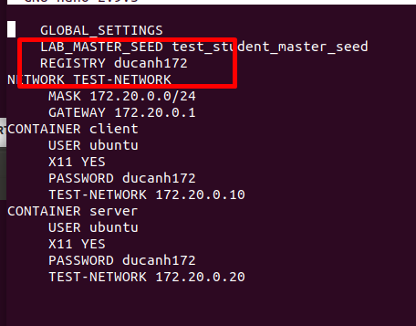
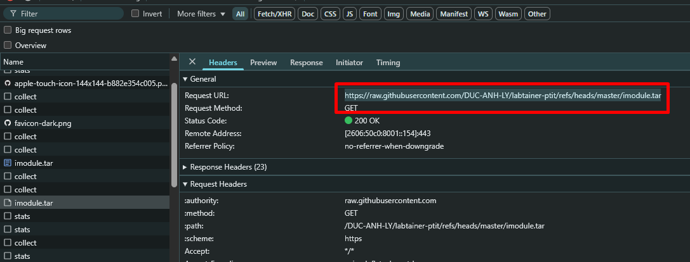
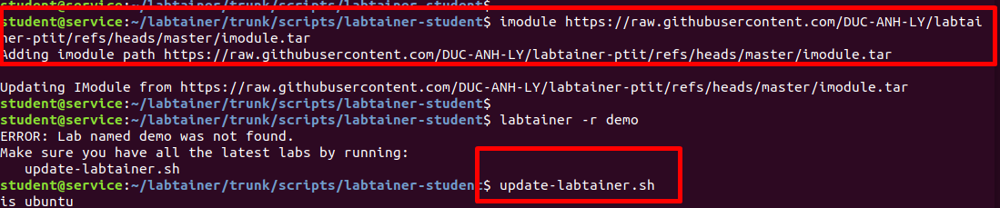

# How to build Labtainer

- Edit using labedit
- then `cd ~/labtainer/trunk/labs` -> `git init` -> `git add <name-of-lab>` -> `create-imodules.sh`: add lab to git and create imdule.tar (we also create it manually using `tar czf imodule.tar <name-of-lab>`). Then `git push` to push this `imodule.tar` to the public git repository
- Finally push docker container based image to dockhub (create the account first) then add your dockerhub's username to `REGISTRY` atttribute in `config/start.config` in the lab, then `cd ~/labtainer/trunk/distrib` -> `./publish.py -d -l <name-of-lab>`
  
- 

# How to import labtainer

- `imodule https://raw.githubusercontent.com/DUC-ANH-LY/labtainer-ptit/refs/heads/master/imodule.tar`

- then run the lab `labtainer -r  <name-of-lab>`
