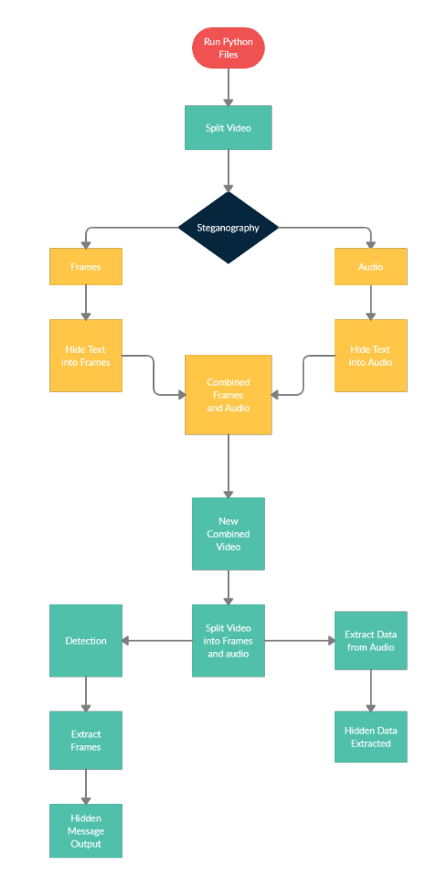
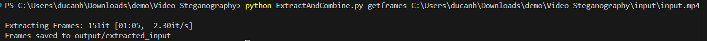
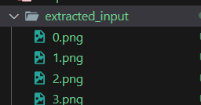

# Video Steganography Tool User Guide

# Step by step demo

- Install libraries

`pip install -r requirements.txt`

- Extracting Frames from Video

`python ExtractAndCombine.py getframes [input_video_file_path]`

- Extracting Audio from Video

`python ExtractAndCombine.py getaudio [input_video_file_path]`

- Hiding Data in Frames

`python Encoder.py`

- select start and end frame where data will be hidden at
- select frames extraction location
- select file to hide

- Hiding Data in Audio

- `python wav-steg.py -h -d "[file to hide]" -s "[input audio file]" -o "[output audio file]" -n "[number of bits]"`

- Combine Frames and Audio into a Video

`python  .\ExtractAndCombine.py combine [frames_dir] [audio_path]`

- Extracting Frames from Steg Video

- Decode Hidden Data in Frames

- Decode Hidden Data in Audio

